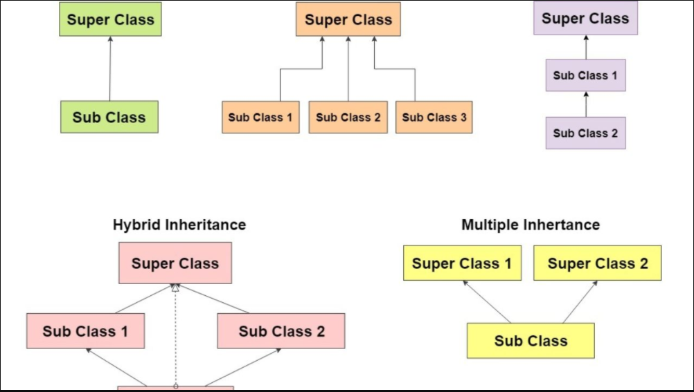

# Read6 - 401 Java 

#  Inheritance and Interfaces

## OOP

* What's Object :

        Software bundle of related state and behavior, It used to model the real-world objects that you find in everyday life.

* What's Class :

        Blueprint or prototype from which objects are created

* What's Inheritance :

        Provides a powerful and natural mechanism for organizing and structuring your software.     

* What's Interface :

        Is a contract between a class and the outside world. When a class implements an interface, it promises to provide the behavior published by that interface      

* What's Package

        Namespace for organizing classes and interfaces in a logical manner.

## Described the Parts of object : 

### Inheritance

- A class that is derived from another class is called a subclass (also a derived class, extended class, or child class). The class from which the subclass is derived is called a superclass (also a base class or a parent class).
- Excepting Object, which has no superclass, every class has one and only one direct superclass (single inheritance). In the absence of any other explicit superclass, every class is implicitly a subclass of Object.
- Classes can be derived from classes that are derived from classes that are derived from classes, and so on, and ultimately derived from the topmost class, Object. Such a class is said to be descended from all the classes in the inheritance chain stretching back to Object.



### Interfaces

 interfaces are such contracts, In the Java programming language, an interface is a reference type, similar to a class, that can contain only constants, method signatures, default methods, static methods, and nested types. Method bodies exist only for default methods and static methods. Interfaces cannot be instantiated—they can only be implemented by classes or extended by other interfaces. 

 Defining an interface is similar to creating a new class:
```java
public interface OperateCar {

   // constant declarations, if any

   // method signatures
   
   // An enum with values RIGHT, LEFT
   int turn(Direction direction,
            double radius,
            double startSpeed,
            double endSpeed);
   int changeLanes(Direction direction,
                   double startSpeed,
                   double endSpeed);
   int signalTurn(Direction direction,
                  boolean signalOn);
   int getRadarFront(double distanceToCar,
                     double speedOfCar);
   int getRadarRear(double distanceToCar,
                    double speedOfCar);
         ......
   // more method signatures
}
```
- To use an interface, you write a class that implements the interface. When an instantiable class implements an interface, it provides a method body for each of the methods declared in the interface. 
